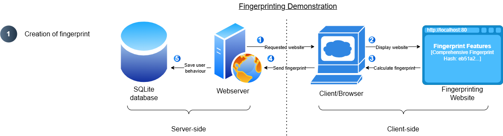
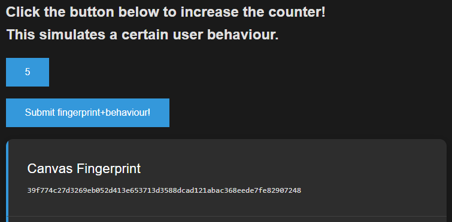

# Problem Statement - Browser fingerprinting

This is the final repository for the project in 'DD2391 - Cybersecurity Overview' at KTH in P1 2025 of group members Kerem Burak Yilmaz, Manuel Michael Voit and Frederic Jonathan Lorenz (Group 12).

Browser fingerprinting poses a significant privacy risk on the modern web by enabling websites to uniquely identify and track users based on subtle differences in their browser/system settings or hardware devices, even in the absence of cookies or other traditional tracking mechanisms. This project addresses the challenge of understanding, demonstrating, and evaluating the effectiveness of fingerprinting techniques and anti-fingerprinting measures. This is achieved by implementing a browser fingerprinting demonstrator (webserver), which collects fingerprinting features, calculates a final fingerprint ID (hash) and can store this information + user data in a database. Furthermore, an automated way to test anti-fingerprinting techniques (client-side) has been implemented using Selenium, in order to be able to make a statement about their effectiveness. Our goal is to systematically analyze how different browsers, privacy settings, and extensions impact the uniqueness and persistence of browser fingerprints, thereby informing users and developers about the strengths and limitations of current privacy-enhancing technologies.


## 1 Installation / Use

Clone the project:

```bash
  git clone https://github.com/keremburakyilmaz/website-fingerprinting.git
```

Go to the project directory:

```bash
  cd website-fingerprinting
```

### 1.1 Browser fingerprinting demonstrator

The browser fingerprinting demonstrator is composed of a local Express webserver and a SQLite3 database. The webserver hosts a fingerprinting website, that collects and calculates different fingerprinting features of the user's browser and displays them. This setup is used to demonstrate the concept of browser fingerprinting and also for the automated testing of different browsers and configurations. The webserver offers multiple endpoints to save and retrieve data from the database. The database stores fingerprints together with user behaviour for the demonstration or with a test configuration for the analysis.

#### 1.1.1 Direct deployment

The direct deployment requires the host system to have Node.JS and the required node modules, that are specified in the `package.json`, to be installed. Once Node.JS is installed, the node modules can be installed like this:
```
# Prerequisites: Node.JS
npm ci
```

The webserver can be started with the following command:
```
npm start
```

The website is hosted on: http://localhost:3000

#### 1.1.2 Docker deployment
Alternatively, the demonstrator can be deployed in a Docker container. For the Docker deployment the host systems only needs a working Docker installation and all the Node.JS dependencies are installed in the container. The database is mounted inside the container for persistent data storage.

```
docker compose up -d
```

The website is hosted on: http://localhost:80

### 1.2 Selenium-automated client
The Selenium-automated client serves the purpose of making automated calls against the webserver using different browsers and configurations of those.

```
# Install Python dependencies for website-calls
cd website-fingerprinting/website-calls
pip3 install -r requirements.txt
```
This python script exists in two variants, once for Windows and once for MacOS. This has been done in order to achieve full browser compatibility as well as having different testing platforms. Reasons why no docker-container or VM was used will be explained later.

Launch the script using different arguments to use different browsers / change browser settings.

```
Example usage:
python3 show_fp_{OS}.py --browser chrome --url http://localhost:80
python3 show_fp_{OS}.py --browser brave --url http://localhost:80 --incognito --privacy-max
python3 show_fp_{OS}.py --browser firefox --url http://localhost:80 --extension ./extensions/firefox-xpi/ublock_origin-1.66.4.xpi --extension ./extensions/firefox-xpi/privacy-badger-latest.xpi --extension ./extensions/firefox-xpi/canvasblocker-1.11.xpi --extension ./extensions/firefox-xpi/noscript-13.0.9.xpi  --incognito
python3 show_fp_{OS}.py --browser chrome --url http://localhost:80 --extension ./extensions/chromium-crx/ublock_origin_lite.crx --extension ./extensions/chromium-crx/privacy-badger-chrome.crx --extension ./extensions/chromium-crx/NoScript.crx  --incognito
```


### 1.2.1 MacOS
For MacOS, the following browsers were used for testing: Chrome, Brave & Firefox.
Install them under these paths:

```
"chrome": "/Applications/Google Chrome.app/Contents/MacOS/Google Chrome",
"brave": "/Applications/Brave Browser.app/Contents/MacOS/Brave Browser",
"firefox": "/Applications/Firefox.app/Contents/MacOS/firefox",
```

### 1.2.2 Windows
For Windows, the following browsers were used for testing: Chrome, Brave, Firefox & Tor.
Install them (+geckodriver) under these paths:

```
"chrome": "C:/Program Files/Google/Chrome/Application/chrome.exe",
"brave": "C:/Program Files/BraveSoftware/Brave-Browser/Application/brave.exe",
"firefox": "C:/Program Files/Mozilla Firefox/firefox.exe",
"tor": "C:/Program Files/Tor Browser/",
"geckodriver": "C:/Program Files/Tor Browser/Browser/geckodriver.exe"
```

## 2 Project description

### 2.1 Fingerprint collection

We used multiple methods to collect the fingerprints of the user. We tried to both include high entropy features (more unique and stable) and low entropy features (less unique and unstable) in order to make our analysis fair. 

| Layer              | Feature                                                                       | Main signal type                         | Typical entropy / stability         | Privacy implication                          |
| ------------------ | ------------------------------------------------------------------------------------ | ---------------------------------------- | ----------------------------------- | -------------------------------------------- |
| **High entropy**   | Canvas, WebGL, Audio, Fonts                                                          | Hardware- and driver-dependent rendering | Very unique; stable across sessions | Great for re-identification, bad for privacy |
| **Medium entropy** | Screen, DPR, color depth, timezone, locale, CPU, RAM, platform, mediaDevices, WebRTC | System configuration and network hints   | Moderately unique, semi-stable      | Adds small differentiating bits              |
| **Low entropy**    | Cookies, language, DNT, plugins, behaviour samples, orientation, motion, WASM        | Environment + user behaviour             | Low uniqueness, high volatility     | Mostly contextual noise                      |


We also created a feature we called __"comprehensive fingerprint hash" (CFH)__, which was basically all the features concatenated together and hashed, in order to distinguish between configurations easier. However, the features WebRTC Candidate, WASM Compile Time (ms), Mouse Sample and Scroll Sample were removed from this since they were extremely unstable and caused our comprehensive hash to be different in each configuration.

### 2.2 Webserver and database

We set up a local webserver and a database for two different reasons:
1.	Simplified demonstration of how browser fingerprinting works
2.	Automated testing of different anti-fingerprinting privacy-enhancing technologies (AFPETs) to test their effectiveness

At first the idea was to have a publicly hosted website that the students and other people can visit to view and store their fingerprint for an interactive demonstration of the concept. However, fingerprinting is subject to data protection laws like the General Data Protection Regulation (GDPR) in the EU as it constitutes the processing of personal data. This does not mean, that fingerprinting cannot be used in general. However, it requires the user to actively opt-in and to allow the data processing and there needs to be a legitimate reason for it. [1][2]
The idea was not pursued any further, in order to avoid any legal uncertainties in hosting the website with a correct privacy policy that the user can opt-in to. Therefore, we ended up with a local deployment of a webserver and database that we can use to process our own data.

#### 2.2.1 Setup

Express [3] is a minimal Node.JS web application framework. Node.js [4] is a cross-platform JavaScript runtime environment, that can be used to execute JS outside of a browser. In this case it is used to run a webserver. The local webserver hosts the website with the fingerprinting implementation that was created in 2.1. The webserver uses a SQLite3 [5] database to store the fingerprinting data. SQLite provides a small SQL database engine and the associated file format is cross-platform. 

There are two different deployment types for the local webserver and database. The direct deployment requires the host system to have Node.JS and the required node modules that are specified in the `package.json` to be installed. Afterwards the webserver can be started with `npm start` on port 3000. For the Docker deployment the host systems only needs a working Docker installation and all the Node.JS dependencies are installed in the container. A `Dockerfile` and `docker-compose.yml` were created to make the deployment as easy as `docker compose up -d`. The database is mounted inside the container for persistent data storage. The website is exposed on port 80.

The webserver implements four different endpoints that are necessary to achieve the two different use cases:
| HTTP method | Endpoint         | Description                                                                  |
|-------------|------------------|------------------------------------------------------------------------------|
| GET         | /                | Default endpoint that returns the fingerprinting website                     |
| GET         | /api/fingerprint | Returns the user behaviour for a specified fingerprint from the database     |
| POST        | /api/fingerprint | Saves/Updates the user behaviour for a specified fingerprint in the database |
| POST        | /api/testing     | Saves the configuration and corresponding test results to the database       |

<br>

The SQLite3 database consists of two different tables. The users table saves a user behaviour for a fingerprint. 

```
users
  id (PRIMARY KEY), behaviour
```

The tests table saves a test configuration and the corresponding test results.

```
tests
  id (PRIMARY KEY), timestamp, browser, privacy_max, incognito, ublock_origin, privacy_badger, noscript, canvasblocker, comprehensive_fingerprint_hash, other fingerprint features
```

The test configuration includes a timestamp, the name of the used browser and boolean values indicating if incognito mode, a privacy-enhanced configuration of the browser and certain extensions were used. The test results in the following columns include all the individual fingerprint features from 2.1.

#### 2.2.2 Fingerprinting Demonstration


The demonstration of the concept of browser fingerprinting is divided in two different phases. In the first phase the user visits a website, that fingerprints him and associates a certain behaviour/preference with the created fingerprint. In the second phase this fingerprint is used by the same or potentially other websites to adapt the content based on the saved user behaviour/preference. One prominent example of this are targeted ads.

<br>
<br>



1. User requests the fingerprinting website and gets it from the Express webserver

2. Client browser displays website


3. JS code is executed and calculates fingerprint: In this case the individual values of the fingerprint are displayed on the website and visible to the user. However, this can also happen in the background without the user noticing or consenting to the data processing.

4. Fingerprint and collected user behaviour/preferences are sent to webserver

In this simplified example the user behaviour/preference is simulated by a button with a counter. The user can decide the click the button to increase the counter. If the user clicks the button, the fingerprint and the number of button clicks (behaviour) are sent as a POST request to the `/api/fingerprint` endpoint.

5. User data is stored in database together with fingerprint
The webserver saves/updates the information in the users table of the database.

<br>
<br>


The first three steps are identical to what is described above.
4. Fingerprint is sent to webserver
This time the request to the webserver with the fingerprint is not triggered by the user. After the fingerprint has been calculated on the client, a request is automatically sent the webserver. This GET request is sent to the `/api/fingerprint` endpoint.
5. Search for fingerprint in the users table of the database
6. Saved user behaviour/preference is retrieved from the database
7. Webserver responds to the client with the information that was retrieved from the database or an adapted version of the website
8. Website displays information that fits to the user behaviour/reflects his preferences
In this simplified example the counter is set to the value that was previously saved in the database. In a real-world example this can be targeted ads that are based on the user’s interests.



#### 2.2.3 Automated testing


The overall process for the automated testing relies on the same setup, but is slightly different.
1. Selenium is used to configure and start the browser. The configuration includes browser settings, extensions and incognito mode.
2. The controlled browser requests the fingerprinting website and gets it from the Express webserver
3. Controlled browser displays website
4. JS code is executed and calculates fingerprint
5. Test configuration and fingerprint features are sent to the webserver via a POST request to the `/api/testing` endpoint. The POST body include a JSON with the test configuration and results. The webserver uses Ajv to validate the JSON. Ajv [6] is a JSON schema validator that can be used to implement complex data validation logic in a declarative manner by defining a JSON schema. This ensures that the JSON includes all the required fields and that the data is in the right format. The following excerpt from the JSON schema shows how this looks like for the browser configuration section of the JSON.

```
...
"config": {
      "type": "object",
      "properties": {
        "browser": {
          "type": "string"
        },
        "privacy_max": {
          "type": "boolean"
        },
        "incognito": {
          "type": "boolean"
        },
        "extensions": {
          "type": "array",
          "items":
            {
              "type": "string"
            }
        }
      },
      "required": [
        "browser",
        "privacy_max",
        "incognito",
        "extensions"
      ]
    },
…
```

6. After the input validation, the webserver parses the received JSON data and saves it in the tests table of the database. 
7. In the last step the data is retrieved from the database and used in the data analysis to produce the results described in 2.4.

### 2.3 Anti-Fingerprinting measures and client-automation

To evaluate the effectiveness of anti-fingerprinting privacy-enhancing technologies (AFPETs), our project implements a varied suite of antifingerprinting measures and automated client testing. By programmatically controlling different browsers with privacy-enhancing settings and extensions, we systematically collect and analyze fingerprinting data under a variety of conditions. This approach enables reproducible, large-scale testing of both standard and hardened browser environments, providing valuable insights into the strengths and limitations of AFPETs analyzed by us.

#### 2.3.1 Research on Severity/Value of fingerprinting features

In order to determine what AFPETs to analyze and use in the scope of this project, it is firstly important to understand what makes a fingerprint feature valuable for a website provider/fingerprint collector. In general, the five following characteristics of a fingerprinting feature are relevant [7]: 

- __Entropy:__ How distinguishable is a new surface/feature from other users? Is it just a boolean value or a 30 bit string that is very unique?
- __Detectability:__ How easily is a feature observable to the user agent and is it likely to be discoverable by fingerprint collectors?
- __Persistence:__ How long stays the characteristics of this feature unchanged? Can they be re-set by user to prevent long-term tracking?
- __Availability:__ Is the feature easily available to every website, or is it only visible in specific contexts (e.g. if a users has interacted in a specific way)
- __Scope:__ In what range is a feature stable and observable → Who can see it and across what context is it the same. (Scoped globally (same on every visited site), e.g. System fonts list → High risk) (Scoped locally (per origin), changes depending on what site you visit, e.g. site-specific localStorage identifier → Can be treated like cookies, less risk)

These parameters help understand against what kind of fingerprinting features users should try to protect themselves the most, therefore this insight will be incorporated into the following research of ours. 

#### 2.3.2 High and Low Level mitigation techniques
On a high-level, AFPETs focus on reducing the effectiveness of browser fingerprinting by addressing the root causes of uniqueness and trackability. A very important concept to note here is that in many cases, there is a trade-off between an increased fingerprinting and user-experience, since many mitigations techniques break the way websites were designed to work originally. Generally it can be stated that stopping browser fingerprinting is an effort that both web developers as well as end-users can contribute to. A website operator reconsider if introducing a new feature of the webpage adds a lot of entropy/uniqueness to the fingerprint and if that justifies the user benefit. Also 'Do Not Track' (DNT/GPC) headers sent by the user can be complied with by the server, however this is not enforced. The issue is that server-side compliance with privacy signals like DNT or GPC is entirely voluntary - malicious or profit-driven websites can simply ignore these requests, and users often have no way of knowing whether their preferences are being respected. As a result, relying solely on server-side cooperation is insufficient for robust privacy protection. Therefore, in this project, we focus on AFPETs that operate from the user side, empowering individuals to take direct control over their own fingerprinting exposure regardless of server behavior.

Hands-On mitigation techniques that can be used by clients can, in general, be classified into the following categories:

- __Blocking[8]:__ Stop websites from accessing a fingerprint feature (canvas access, WebGL, plugins, AudioContext,...) → This can be achieved via browser settings, extensions, or on OS-level. The downside is that this can break thefunctionality of the site
- __Spoofing / Randomization[8][9]:__ Return false or variable data, so that fingerprint is inconsistent across visits → Can be achieved via extensions or browser features. Caveats: Poorly implemented randomization makes you unique, spoofing can break site contents
- __Simplifying / Standardization[9]:__ Reduce granularity of reported values so many users look the same (placed into 'buckets' with other users) → Browser choice & settings have effect. Cons: Must be done by browser to be effective at scale
- __Clearing/Partitioning Local State[7]:__ Remove/Isolate Storage that can be used for re-identification (Cookies, localStorage,...) → Can be achieved in Browser (e.g. Container tabs, Incognito mode,..). Caveat: Does not block JS fingerprinting
- __Compartmentalization:__ Separate browsing contexts so tracking can’t follow you across domains (work, social, banking,...) → Use of different browsers or even different VMs/Containers/OS accounts. Cons: User management overhead, does not help if same device attributes leak in all contexts (e.g. same GPU)
- __Detectability / Permission prompt[7]:__ Make sensitive API calls visible to users (allow/deny), reduce silent collection (e.g. geolocation, camera, microphone,..) → Should be enforced by all modern browsers. Caveat: Many fingerprinting APIs are readable without prompt

The following tests we will focus on the first four categories because they offer practical, user-accessible ways to reduce fingerprinting risk without requiring major changes to browsing habits or infrastructure.


#### 2.3.3 Development of test plan for AFPETs

For our evaluation of AFPETs, we designed a systematic testing setup that reflects both real-world user choices and the diversity of available privacy tools. We selected four major browsers: Chrome, Firefox, Brave, and TOR. This decision was made, because they represent a spectrum from mainstream to privacy-focused, each with different default behaviors and support for privacy features. For each browser, we tested two configurations: The default (base) setting, which provides minimal fingerprinting protection (depending on browser), and an enhanced configuration with all available privacy settings maximized. For more information about the privacy-enhanced settings for each browser, please refer to the browser-automation scripts, which can be found under `./website-calls/show_fp_MacOS.py` or `./website-calls/show_fp_Windows.py` respectively. More on those later.

Furthermore, we incorporated popular privacy extensions: uBlock Origin, Privacy Badger, CanvasBlocker, and NoScript. These extensions were chosen for their widespread use and their different approaches to blocking trackers and fingerprinting vectors. We tested each browser with all extensions off and with all extensions enabled (except for Canvasblocker, since it is not available on Chromium-based browsers), to isolate the effect of these tools. Incognito or private browsing mode was also toggled on and off, as it is a common user practice and can affect fingerprinting surfaces and local state persistence.

By systematically varying browser, privacy settings, extension state, and incognito mode, we are able to generate a wide range of fingerprinting scenarios. This approach enables us to assess the effectiveness of each AFPET and their combinations, providing insights into both the strengths and limitations of each privacy tool. Our automated client uses Selenium to ensure reproducibility and coverage of all combinations, making our results robust and representative of real-world usage patterns.

#### 2.3.4 Browser-automation using Selenium (Testing fingerprinting website)

##### 2.3.4.1 Failed attempts and hurdles

In order to create a comparable testing environment, the original idea was to user a docker virtualized environment, for the purpose of hosting the client that we'd use to perform the website calls, in order to test our fingerprinting abilities and mitigations. This would come with the advantage, that we could easily adapt and rebuild the container to perform tests on different OS'es and their effect on the fingerprinting findings. However, after several failed attempts, this topic was discussed again and we discussed that it might be unclear how using a docker-container to perform the website calls might affect the browser-fingerprint. Concretely, we were worried about the examples being too unrealistic, since being in a docker-container would provide 'lab-environments', which is great for repeatibility, but poor for realism. For instance, it was unclear what the abstraction of hardware did to the fingerprint, since the browser cannot see a 'real' hardware stack, so fingerprinting features depending on those (WebGL, Canvas or Audio-FP) could not be represented realistically. These and further factors lead to us abandoning the idea of testing inside a docker-container. The failed attempts can be seen in `./website-calls/obsolete/`.

The following approach was to utilize a very standardized virtual machine. This would come with the benefit of having a virtualized but more realistic hardware stack, while at the same time still being somewhat repeatable for testing (standard blanc ubuntu image with standard installs of browsers, drivers, libraries → very lightweight). However, when testing this it became clear that there is a handful of bugs of the automation platform (Selenium) in combination with the respective drivers (chromedriver & geckodriver). Since we were not able to resolve these, it was ultimately decided that we'd conduct our website calls from our host OS'es directly.

Therefore our python script to automate browser testing was adapted for both MacOs `./website-calls/show_fp_MacOS.py` as well as Windows `./website-calls/show_fp_Windows.py`. Please follow the installation instructions mentioned up top to get these running. One Caveat is that the TOR Browser is designed in order to resist browser automation and scripted control. This was done, since enabling automation requires to expose an inter-process communication API, which itself can be used to break anonymity. As the browsers philosophy is based on preventing this from happening, remote-control protocols like Marionette (used by Selenium) are disabled by default. There are certain projects like 'tbselenium' which break these intentional automation-blockers by TOR browser. However, since this is only available for Linux and Windwos (not MacOS), we ultimately decided to only test Chrome, Brave and Firefox on MacOS and include TOR-browser only on our tests in the Windows environment. 

##### 2.3.4.2 General functionality of Selenium browser-automation script 

The first step when running the Selenium browser-automation script is to pass arguments, which are then parsed and affect the rest of the execution: 

```
--browser (required): Specifies which browser to use (chrome, brave, firefox, or tor (On Windows Script)).
Example: --browser chrome

--url (required): The target URL to visit, which fingerprints us.
Example: --url http://localhost:80

--headless: Runs the browser in headless mode (no visible window), which may affect the fingerprint. (experimental only, no final use)
Example: --headless

--privacy-max: Enables all available privacy and anti-fingerprinting settings for the chosen browser, settings vary from browser to browser, more on that later
Example: --privacy-max

--incognito: Launches the browser in incognito/private mode.
Example: --incognito

--extension: Path to a browser extension file (.crx or .xpi) to load; can be used multiple times for multiple extensions.
Example: --extension ./extensions/chromium-crx/ublock_origin_lite.crx --extension ./extensions/chromium-crx/privacy-badger-chrome.crx
```

After the arguments have been parsed, they are used to build a functioning driver of the respective browser. This is the point where the Selenium API is used to manipulate browser options/preferences/settings. This process varies slightly depending on the browser type used.

The browser's privacy settings that could be either left at base settings (no argument) or set to a very restrictive set of settings (--privacy-max) deserves more extensive explanation. In those cases, we conducted research [10][11] in order to find a large number of settings that could help reduce fingerprintability (Though the list used does not claim to be exhaustive). Generally it can be noted, that browsers based on the same driver (Chrome &  Brave ↔ Firefox & TOR) generally have the same/very similar settings that can be tweaked. However, privacy-based browser like Brave and TOR in many cases have secure settings preconfigured, making it redundant to set those again manually. For more in-detail explanation of the individual settings, please refer to the inline-comments made in the respective scripts.

To enable automated testing with privacy extensions, we downloaded the relevant extension files (.crx for Chromium-based browsers and .xpi for Firefox-based browsers) from official sources and manually loaded them into the browsers via Selenium’s extension loading functionality. While it is important to note that the presence of certain extensions can itself serve as a fingerprinting vector, potentially reducing privacy, especially in browsers like Tor where NoScript is already built-in, we chose to include them in our tests to systematically evaluate their impact on fingerprinting surfaces. This allows us to compare both extension-free and extension-enabled scenarios across all browsers, even if using extensions is not always recommended for maximum anonymity.

Once the driver for making the website-call has been successfully created, our fingerprinting website is being called on localhost. We include a unique cache-busting query parameter in the request in order to avoid any browser to load a cached version of the website. This ensures we always get a fresh copy of the data from the server.

The fingerprinting data is displayed on the website. In order to fetch and parse this data, the HTML is searched and stripped of whitespaces. Afterwards, the found values are fed into a python dictionary, where the name of the fingerprinting value represents the key, and its content is stored as the value. Next, this dictionary containing the fingerprinting data of the respective browser configuration is used to create a JSON of the following structure:

```
combined_output = {
    "timestamp": timestamp,
    "config": {
    "browser": browser choice,
    "privacy_max": privacy_max (yes/no),
    "incognito": incognito (yes/no),
    "extensions": extensions selected (array),
    },
    "title": Title of webpage,
    "features": {lists all key/value pairs of dictionary, even if value is emppty}
}
```

As can be seen above, the JSON includes all data that is relevant to the individual request made - including the used configuration as well as the output of the webserver. This is necessary so that for later analysis, all setting-output combinations are traceable and stored uniformly.

In the next and final step, this uniform JSON file is passed to the `/api/testing` endpoint of our fingerprinting server using a POST request. This triggers the server to store the passed data in its databse. From this aggregated dataset, a comprehensive analysis of all different browsers (+ settings, extensions, incognito modes) and their respective fingerprinting surface can be conducted.

##### 2.3.4.3 Automated testing procedure using bash script

The general idea is to make calls to the webserver using different combinations of browsers, browser-privacy-settings, privacy modes (incognito) and extensions. Since this creates a big amount of different possible combinations, it is necessary to automate this task. Using a bash script on MacOS (`./website-calls/run_all_combinations.sh`) and a batch script on Windows (`./website-calls/run_all_combinations.bat`), this was accomplished.

Despite this available automation, it was decided to restrict the amount of different combinations, in order to work with/analyze a more manageable dataset size. Concretely, we ended up using four browsers (three on MacOS): Chrome, Brave, Firefox and TOR. For each browser, the incognito mode was toggled on/off, a maximum of browser privacy settings (or none) were applied (on/off) and either all exensions (4 on geckodriver browsers, 3 on chromium browsers) (or none) were applied (on/off). This leaves 2^3=8 combinations per browser. Furthermore, every combination was used to make two calls to the webserver, in order to verify whether there were any changes to the detectable fingerprint. In total 3x8x2=48 website calls were made on MacOS and 4x8x2=64 calls were made on Windows.

### 2.4 Data analysis

We created a metric called __privacy score__, which showcases the amount of settings and extension enabled to increase privacy:

Privacy Score = (Incognito + uBlock + Badger + NoScript + CanvasBlocker)

We used a binary system to show if the setting is open or not. 

An example would be:

| Feature                    | Chrome  | Tor |
| -------------------------- | ------- | --- |
| Incognito                  | 0       | 1   |
| Do Not Track               | 0       | 1   |
| uBlock Origin              | 0       | 1   |
| Privacy Badger             | 0       | 1   |
| NoScript                   | 0       | 1   |
| CanvasBlocker              | 0       | 1   |

__Interpretation:__
- Higher privacy score = higher protection but also more “drift” (different hash each session).
- Lower privacy score = stable but trackable.
- We found a correlation of −0.74 between privacy score and fingerprint uniqueness. It means that the more private your setup, the less predictable and less reusable its fingerprint.
- However, in some features, we saw that uniqueness increase alongside the privacy. This is what we called, __privacy-uniqueness paradox__, where features improves policy-level privacy but worsens statistical-level anonymity, which we will talk about more later on.

We also created another metric called __unique CFH rate__ to evaluate how stable each browser configuration was. This value measures the uniqueness rate of fingerprints in every configuration. For example for this mock configuration:

| CFH hash    | Count (how many times seen)  | Unique? |
| ----------- | --------------------------   | ------- |
| abc123...   | 3                            | No      |
| def456...   | 1                            | Yes     |
| ghi789...   | 1                            | Yes     |
| jkl012...   | 2                            | No      |

Unique CFH rate would be 2 (total number of unique CFH's) / 3 + 1 + 1 + 2 (total number of CFH) = 0.2875 = ~%29

We isolated every variable and ran this test through each configuration of that set variable to find this metric.

__Interpretation:__
- 1.0 unique CFH rate means that every run creates a different hash, meaning that it is unstable and cannot be used to track the user. As unique CFH rate comes closer to 1, it means that it is closer to being secure and private.
- 0.0 unique CFH rate means that every run creates the same hash, meaning that it is stable and persistent, which can be used to track the user. As unique CFH rate comes closer to 0, it means that it is closer to being less secure and private.

#### 2.4.1 Cross Browser Comparison

| Browser     | Unique CFH rate | Avg. Privacy Score | Uniqueness vs Chrome | Privacy vs Chrome | Interpretation  |
| ----------- | --------------- | ------------------ | ---------------------| ----------------- | --------------- |
| **Chrome**  | 0.00            | 2.25               | -                    | -                 | Fully deterministic: every run identical.|
| **Brave**   | 0.75            | 2.25               | +0.75                | 0.00              | 75 % higher uniqueness due to randomized Canvas/Audio. Privacy score same, meaning Brave’s *built-in* defenses don’t all register in your simple Boolean score.|
| **Firefox** | 0.38            | 2.75               | +0.38                | +0.50             | Partial blocking adds moderate entropy and small privacy gain.|
| **Tor**     | 1.00            | 3.00               | +1.00                | +0.75             | Every fingerprint hash unique = perfect session isolation, highest privacy.|

__Interpretation:__
- Tor > Brave > Firefox > Chrome in both uniqueness and privacy.
- The magnitude of difference is large: Tor’s CFH variability is 2.6× higher than Brave’s (1.00 / 0.38) and infinite relative to Chrome’s 0.00 baseline.

#### 2.4.2 Effects of Incognito Mode

| Mode          | Unique CFH Rate | Change vs Normal |
| ---------     | --------------- | -----------------|
| **Default**   | 0.44            | -                |
| **Incognito** | 0.63            | +0.19 uniqueness |

__Interpretation:__
- Incognito isolates cookies, localStorage, and session identifiers, altering navigator.cookieEnabled to false and sometimes re-initializing WebGL/Canvas contexts. This explains the ~%43 uniqueness rise. By making each session unique, users are more untraceble than default.

#### 2.4.3 Effects of uBlock Origin Extension:

| Condition      | Unique CFH Rate | Change vs Baseline (OFF)|
| -------------- | --------------- | ------------------------|
| **uBlock OFF** | 0.63            | -                       |
| **uBlock ON**  | 0.44            | −0.19 uniqueness        |

__Interpretation:__
- Enabling uBlock Origin disables or spoofs numerous tracking APIs (e.g., navigator.plugins, media enumeration lists).
- Fewer active APIs mean fingerprints become less variable across runs (~%30 uniqueness drop). And this is one of the examples of the privacy-uniqeness paradox. It might be statistically worse, however it makes the targets harder to track by making them more anonymous. 

__Note:__
- The identical numeric pattern (0.63 and 0.44) between the Incognito and uBlock Origin tests is coincidental.
- Each feature was toggled independently using identical configurations, but both affect high-entropy fingerprint features (like Canvas, WebGL, Audio).
- Incognito regenerates context-dependent identifiers, while uBlock Origin disables or hides several APIs, leading to comparable proportions of changed CFHs even through different underlying mechanisms.

#### 2.4.4 Combined Extension Stack (Privacy Badger / NoScript / CanvasBlocker)

We noticed that we have 4 different combinations of extension configuration:

| uBlock | Badger | NoScript | CanvasBlocker | Likely source              | Description                                       |
| :----: | :----: | :------: | :-----------: | :------------------------- | :------------------------------------------------ |
|    0   |    0   |     0    |       0       | Any browser w/o extensions | Default base configuration                        |
|    0   |    0   |     1    |       0       | Tor                        | NoScript built-in                                 |
|    1   |    1   |     1    |       0       | Chromium (Chrome/Brave)    | All compatible .crx extensions loaded             |
|    1   |    1   |     1    |       1       | Firefox                    | All four extensions (.xpi) supported              |

| uBlock | Badger | NoScript | CanvasBlocker | Unique CFH Rate | Avg. Privacy Score | Rows | 
| -----: | -----: | -------: | ------------: | --------------: | -----------------: | ---: |
|      0 |      0 |        0 |             0 |       0.500     |           0.50     |   24 |
|      0 |      0 |        1 |             0 |       1.000     |           1.50     |    8 |
|      1 |      1 |        1 |             0 |       0.250     |           4.00     |   16 | 
|      1 |      1 |        1 |             1 |       0.625     |           4.75     |   16 | 

__Interpretation:__
- Chromium browsers like Chrome or Brave not supporting CanvasBlocker is a huge difference. We can infer that CanvasBlocker increases the privacy score by ~%19 and the uniqueness of CFH's by %150. So by simply using Firefox, users can protect themselves much more.
- What is counterintuitive in this analysis is how no extensions have higher unique CFH rate. It is also an example of privacy-uniqueness paradox. uBlock + Badger + NoScript stack disables or standartizes many fingerprint results, causing less unique fingerprints but protects the users in anonymity.
- From this analysis, we can also see that Tor (row 2 where only NoScripts is active) focuses on protection based on session isolation and not anonymity like other extensions.
- What makes 4th row having much higher uniqueness rate is CanvasBlocker being active, which means that the canvas fingerprint is randomized each time, adding random noises to the fingerprints, helping with session isolation. 

---

__Note: Next analysises will be done by inferring the fingerprints we collected and the behaviour of browsers rather than direct testing.__

---

#### 2.4.5 Effect of WebGL Blocking / Spoofing

| WebGL Status              | Unique CFH Rate | Privacy Score | Change vs Real GPU         |
| ------------------------- | --------------- | ------------- | -------------------------- |
| **Real GPU (exposed)**    | 0.41            | 2.3           | -                          |
| **Spoofed ANGLE (Brave)** | 0.63            | 2.4           | +0.22 unique, +0.1 privacy |
| **Software Mesa (Tor)**   | 1.00            | 3.0           | +0.59 unique, +0.7 privacy |

__Interpretation:__
- WebGL spoofing or software fallback removes the most device-specific entropy source (GPU driver ID).
- Tor’s Mesa/llvmpipe software renderer eliminates hardware signatures entirely, raising uniqueness to %100.
- Brave’s ANGLE spoof still gives stable but less tracable signatures (~%53 uniqueness rise compared to exposed GPU).

#### 2.4.6 Effect of Canvas Fingerprint Blocking

| Canvas Status                | Unique CFH Rate | Privacy Score | Change vs Enabled           |
| ---------------------------- | --------------- | ------------- | --------------------------- |
| **Enabled (deterministic)**  | 0.45            | 2.2           | -                           |
| **Randomized (Brave)**       | 0.75            | 2.3           | +0.30 unique, +0.1 privacy  |
| **Prompt/Blocked (Firefox)** | 0.38            | 2.75          | −0.07 unique, +0.55 privacy |
| **Fully Blocked (Tor)**      | 1.00            | 3.0           | +0.55 unique, +0.8 privacy  |

__Interpretation:__
- Canvas is the highest-entropy visual feature. Any change on it (randomization or blocking) greatly changes the hash.
- Brave’s session randomization causes ~%67 uniqueness rise while retaining a stable score.
- Tor’s full block removes the feature entirely = highest privacy and maximum CFH change.

#### 2.4.7 Effect of Audio Fingerprint Randomization / Blocking

| Audio Context Status   | Unique CFH Rate | Privacy Score | Change vs Stable           |
| ---------------------- | --------------- | ------------- | -------------------------- |
| **Stable (default)**   | 0.40            | 2.2           | -                          |
| **Randomized (Brave)** | 0.72            | 2.3           | +0.32 unique, +0.1 privacy |
| **Blocked (Tor)**      | 1.00            | 3.0           | +0.60 unique, +0.8 privacy |

__Interpretation:__

- Audio processing variations are minor but sensitive to privacy modes.
- Brave’s randomized OfflineAudioContext hash raises uniqueness by %80.
- Tor disables audio fingerprinting completely, adding %150 extra uniqueness and +0.8 privacy points.

---

---

### 2.5 (uniqueness analysis?)


## 3 Individual contributions

### 3.1 Kerem Burak Yilmaz
During the project, my main focus was on technical implementation with a side of research on how to collect the data, and what it tells. I researched about what fingerprinting techniques are being used in the real world, and how they work, and I implemented the methods I and Manuel found. I created a [mock website](https://youjustgothacked.lol) (a basic website that has only basic HTML/CSS/JavaScript) to collect the fingerprints and show them, which became the foundations of what we currently did with the local server. I also hosted and bought the domain for the website since we want to do a live demo to everyone and show that how easy their fingerprints can be collected. We created the local server version besides this one later, since we wanted our data's to be collected and stored locally.

I also analyzed the data from the test results, trying to understand what each configuration gives us, and how each configuration and toggle affect our privacy. I created metrics to make the analysis more concrete. I also interpreted these analysis and wrote my findings.

Finally, I contributed to the written report, by authoring the following sections:
- 2.1 Fingerprint collection
- 2.4 Data analysis
- 3.1 Individual Contribution


### 3.2 Manuel Michael Voit
At the start of the project, I looked into how browser fingerprinting works and what use cases there are, both legitimate and malicious. Kerem and I researched what different fingerprinting techniques there are, how they work, how effective they are and what data you can use for fingerprinting.

My responsibility was the implementation of the local webserver and the database. I came up with the idea for the simplified demonstration of fingerprinting and realized it with this setup. I used the fingerprinting website that Kerem created and added the buttons and the logic behind them for the demonstration. For the testing I coordinated the interface with Frederic and implemented it. I created and tested the necessary endpoints of the webserver and the database tables.

I also supported Frederic in creating the browser automation script for the testing. I discussed the use of a dockerized environment or VMs with him and fixed problems related to the loading of extensions with Selenium for Chrome and Firefox. I set up a testing environment on Windows for all four browsers: Chrome, Brave, Firefox and Tor. In order to do that, I ported the Selenium script that Frederic created for MacOS to work for Windows. Selenium does not support Tor browser automation out of the box. The [tor-browser-selenium](https://github.com/webfp/tor-browser-selenium) GitHub repository offers a way to automate Tor on Linux. [tor-browser-selenium-windows](https://github.com/Mohamed-Emad126/tor-browser-selenium-windows) is a fork of this repository. The files in the folder `./website-calls/tbselenium/` are not ours and originate from the beforementioned repository. This is also mentioned in the README and LICENSE file in the folder. I integrated this code into the testing script to allow us to automate the Tor Browser with Selenium WebDriver on Windows. Furthermore, I translated the BASH script for MacOS that executes all the test into a batch script for Windows and performed the tests on Windows.

I worked on the following sections of the written report:
- 1.1 Browser fingerprinting demonstrator
- 2.2 Local webserver and database
- 3.2 Individual Contribution


### 3.3 Frederic Jonathan Lorenz 
During the project, my individual contributions focused on both research and technical implementation aspects of anti-fingerprinting measures. I began by investigating the severity of various fingerprinting features (2.3.1), identifying which browser and system attributes are most valuable to fingerprint collectors and therefore most critical to protect. This research was used as foundation for a review of existing mitigation techniques, evaluating their effectiveness and practicality for real-world use (2.3.2). Based on these findings, I developed a concrete test plan that balanced thoroughness with feasibility (keeping the generated data in manageable quantities). This was done by selecting a representative subset of browsers (Chrome, Firefox, Brave, and Tor), privacy extensions, browser settings, and the use of incognito mode to systematically analyze their impact on fingerprint uniqueness and privacy. (2.3.3)

On the technical side, I conceptualized and implemented the browser automation script using Selenium, with a primary focus on the MacOS environment. This involved designing the argument parsing logic, building browser drivers, and integrating the automated loading and testing of privacy extensions. I also researched and implemented a wide range of browser privacy settings, ensuring that the script could flexibly switch between base and privacy-maximized configurations. Additionally, I handled troubleshooting and iterative improvements to the script, including attempts to standardize the client environment using containers and virtual machines (although these approaches were ultimately set aside in favor of direct host OS testing for simplicity and realism reasons). Furthermore, I collaborated with my peers to make the script is compatible with the webserver (fetch FP data and post JSON to API). The entire resulting client test script (except for the extension of it that makes Tor automation on Windows possible) was my work and enabled automated, reproducible browser fingerprinting experiments.

Finally, I contributed to the written report, by authoring the following sections:
-	Problem statement
-	Installation/Use of Selenium automated Client (1.2)
-	Anti-Fingerprinting measures and client-automation (2.3)
-	Individual contribution (3.3)


## 4 References
[1] https://www.eff.org/deeplinks/2018/06/gdpr-and-browser-fingerprinting-how-it-changes-game-sneakiest-web-trackers

[2] https://ico.org.uk/about-the-ico/media-centre/news-and-blogs/2024/12/our-response-to-google-s-policy-change-on-fingerprinting/

[3] https://expressjs.com/

[4] https://nodejs.org/en/

[5] https://sqlite.org/

[6] https://ajv.js.org/

[7] https://www.w3.org/TR/fingerprinting-guidance/

[8] https://jscholarship.library.jhu.edu/server/api/core/bitstreams/22de9dbc-ebe5-4a45-ae00-25833b6ad227/content

[9] https://tb-manual.torproject.org/anti-fingerprinting/?utm_source=chatgpt.com

[10] https://peter.sh/experiments/chromium-command-line-switches/

[11] https://github.com/arkenfox/user.js
